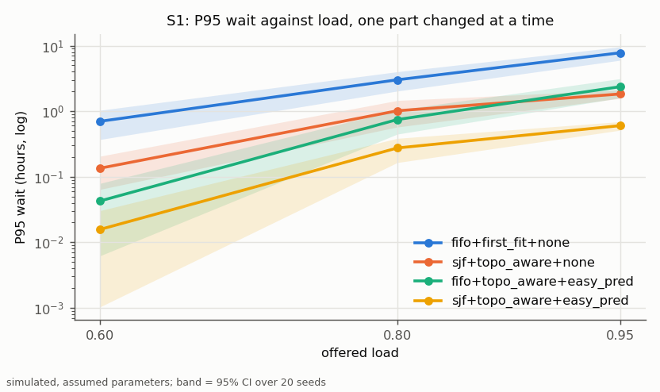
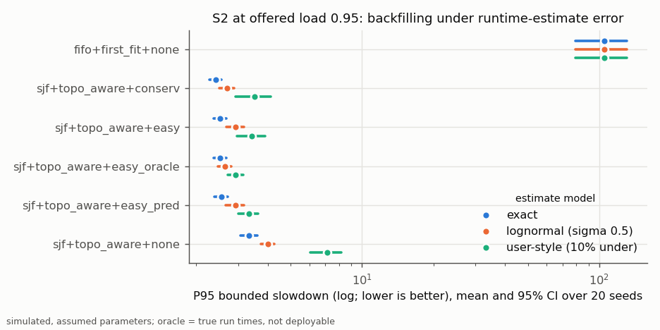
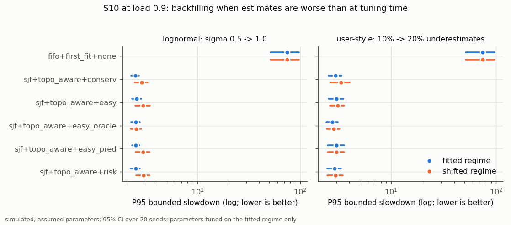
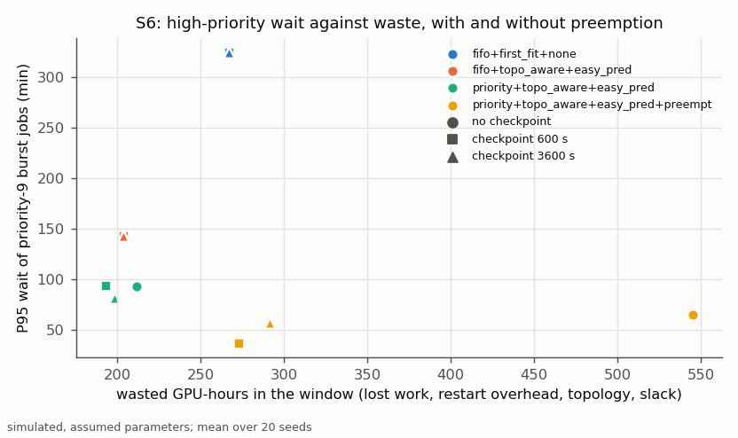
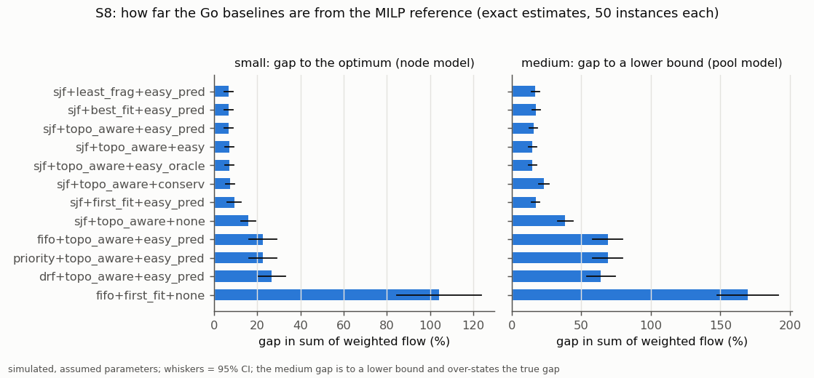
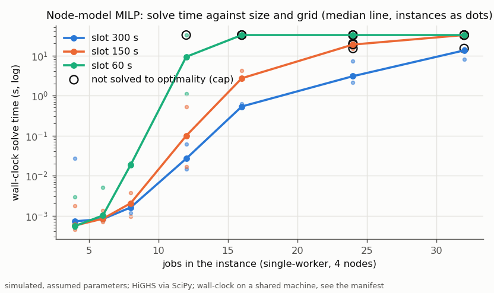
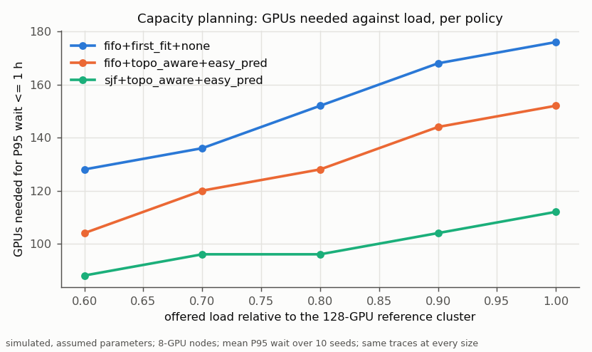

# GPU Cluster Scheduler

A deterministic discrete-event simulator and benchmark for scheduling policies on heterogeneous GPU clusters: gang jobs on nodes and racks, GPU classes, priorities and tenants, preemption with checkpoint loss, topology penalties, and runtime-estimate error. Baseline policies are written in Go; optimization-based policies (an offline MILP reference, a rolling-horizon MILP, and a two-stage stochastic MILP) live in a Python harness and run in the same simulator through a line-based protocol.

> **Everything here is simulated, with assumed parameters.** Results say how policies compare *in this simulation, under these assumptions* (docs/simulator.md). They are not measurements of a real cluster or of a production scheduler. This project does not replace the Kubernetes scheduler, Kueue, or Volcano.

**Status:** benchmarked in simulation. Tier 1 of the plan is complete (simulator, Go baselines, Python harness with the MILP models, a reproducible benchmark with committed results), and so are the Tier 2 extensions: uncertainty-aware policies under an estimate-error shift, replay of a public trace on a simulated cluster, heterogeneity-aware placement, quotas, node failures, a capacity-planning sweep, and a replay mode with a Prometheus-format `/metrics` endpoint, plus an optional cross-check of the MILP results with a current HiGHS and Gurobi ([docs/milp.md](docs/milp.md) §7). Kubernetes integration and gRPC are planned, not built.


## Available now

- **Simulator** (`simulator/`): virtual millisecond clock; gang placement of workers on nodes with GPU, CPU, and memory capacity; GPU classes with speeds; a topology factor for placements that span nodes or racks; preemption with checkpoint-based retained work and restart overhead; node failures with kill, requeue, and repair; deadlock and invalid-action detection; exact accounting identities. Model and assumptions: [docs/simulator.md](docs/simulator.md).
- **Traces**: schema v1 CSV with manifests (SHA-256) and a strict loader; a generator with Poisson, gamma-renewal, Markov-modulated, diurnal, and batch arrivals, per-user heavy-tailed run times, gang mixes, tenants, priorities, and three runtime-estimate models; a converter for the Helios `cluster_log.csv` (Hu et al., SC'21; CC-BY-4.0; downloaded by a script, not committed) with synthetic estimates. Formats: [docs/contracts.md](docs/contracts.md).
- **Go policies**, composed from four parts — order (`fifo`, `priority` with aging, `shortest_estimate`, `drf`), placement (`first_fit`, `best_fit`, `least_fragmentation`, `topology_aware`, `hetero_ect`), backfill (`none`, `easy`, `conservative`, `easy_predicted`, `risk`, `easy_oracle`), preemption (none, or `+preempt`: priority preemption minimizing lost work) — plus optional quotas (`+quota_strict`, `+quota` with borrowing, `+reclaim`), named like `fifo+best_fit+easy` or `priority+first_fit+easy+preempt`. `risk` backfills with a quantile of each user's run-time/estimate ratios; `hetero_ect` picks the GPU class with the earliest expected completion; `easy_oracle` reads the true run times: an oracle for context, not deployable.
- **Python harness** (`harness/`): the external-policy server (protocol v1 over stdin/stdout); FIFO and EASY in Python, which produce assignment logs identical to the Go versions (conformance test); the offline MILP (pool model: lower bound; node model: exact for single-worker jobs) cross-checked against exhaustive search; the online `milp_rolling` and `scenario_milp` (two-stage stochastic, run-time scenarios drawn from the completion history, a CVaR term), both solving in a worker process with a hard time cap. Formulations: [docs/milp.md](docs/milp.md).
- **Benchmark** (`cmd/benchmark`): equal-budget tuning on tuning seeds, frozen configurations, evaluation on 20 disjoint seeds with 95% Student-t intervals, paired comparisons against `fifo+first_fit+none`, win/tie/loss counts, an oracle, MILP optimality gaps, a solve-time sweep, a sensitivity sweep, a capacity-planning sweep, a check of whether every term of the score J varies across policies by more than across seeds (it found four terms that do not; see "Reading J"), and decision-cost microbenchmarks (five repetitions each). Protocol and scenarios: [benchmarks/README.md](benchmarks/README.md).
- **Replay mode** (`cmd/scheduler -replay-speedup N`): paces one simulation against the wall clock and serves its state as Prometheus text-format gauges on `http://127.0.0.1:18200/metrics` (simulated values; no Prometheus server is shipped).
- **Checks as tests**: Lindley recursion (exact); M/G/1 Pollaczek-Khinchine and M/M/c Erlang C (statistical); Little's law and allocation identities (exact, integer milliseconds), the waste identity (relative 1e-9), and an independent recomputation of every run's accounting from its placement (both asserted on every benchmark run; a test corrupts records to show the recomputation catches what the identities miss); the EASY reservation guarantee; invariants and byte-identical reruns for 165 Go policy combinations, quota variants included; MILP against exhaustive search and plan replay; Go/Python conformance; misbehaving external policies.

## Results (simulated)

All numbers below come from `go run ./cmd/benchmark` on commit `c190526` with the tuning frozen in commit `b11255a` (`benchmarks/results/benchmark/manifest.json`): 20 evaluation seeds per scenario (10 for S9, S11, S13, the sensitivity variants, and the capacity sweep; 50 instances per S8 set), mean ± 95% Student-t half-width. The frozen tuning file was last committed in `b11255a`: its Tier 1 entries come from `-tune` on an earlier commit (`configs/tuned/tuning_manifest.json`) and were never re-tuned, the Tier 2 entries from `-tune-add` (`tuning_add_manifest.json` records the last of those runs); code changed between the Tier 1 tuning and the evaluation commit (review fixes, Tier 2 features), and the Tier 1 simulation results stayed identical on every metric present in both versions except `broken_reservations` in S6 and its sensitivity variants. Machine: Intel Core i9-14900KF (24 cores, 32 logical processors), 96 GB RAM, Windows 11, Go 1.27.1, Python 3.12.3, SciPy 1.13.1 with HiGHS 1.2.0, 16 parallel runs; the machine was shared with other jobs, which affects only the wall-clock and CPU-time values. Scenario definitions: [benchmarks/README.md](benchmarks/README.md). The full per-scenario tables, with every policy, are in [benchmarks/results/benchmark/table.md](benchmarks/results/benchmark/table.md).

The tuning picked the default parts on S1 at load 0.80 (tuning seeds only): `shortest_estimate` order, `topology_aware` placement, `easy_predicted` backfilling. Each comparison varies one part around them. J is the summary score of `docs/contracts.md` §5; every metric is reported next to it, and two caveats about J are listed under "Reading J" below.

In this simulation, under these assumptions (paired differences are policy minus comparison on the same seeds, with a 95% t interval):

- **Backfilling and the queue order matter most.** On the homogeneous 128-GPU cluster at offered load 0.95 (S1), the P95 wait is 7.79 ± 1.80 h for `fifo+first_fit+none`, 1.83 ± 0.26 h for `shortest_estimate+topology_aware+none`, and 0.57 ± 0.09 h with EASY backfilling added (`shortest_estimate+topology_aware+easy`); P95 bounded slowdown falls from 104.7 to 2.5. In every scenario with the synthetic workload (S1–S7, S9–S12, S14, S15, and their variants), every policy beats the baseline on J on every seed, except strict quotas in S14; the replay S13 is the other exception (below).
- **Placement is a second-order effect on one GPU class.** Topology-aware placement has the lowest mean J of the four class-blind placements in S1, the S3 stream, S4, and S7 (S3 stream: 0.18 ± 0.04 against 0.20–0.21), mostly through less topology waste (goodput 0.951 against 0.937–0.939 in the S3 stream), but not in the S3 batch, where all four are within 0.01 of each other; best fit and least fragmentation do not improve on first fit by more than the confidence intervals.
- **Heterogeneity-aware placement pays on mixed GPU classes.** On 8 A100-class plus 8 V100-class nodes (S12), `hetero_ect` (pick the class with the earliest expected completion, never mix classes) reaches J 0.14 ± 0.02 against 0.28 ± 0.04 for topology-aware placement without class constraints, and 0.12 ± 0.01 against 0.18 ± 0.03 with 15% of jobs pinned to each class; it removes the mixed-speed slack (0 against 692 ± 134 GPU-hours without class constraints) and lowers P95 bounded slowdown (2.81 against 3.99).
- **Estimate error.** With user-style estimates at load 0.95 (S2), the oracle reaches J 0.18 ± 0.02, user-history predictions 0.21 ± 0.03, plain EASY 0.22 ± 0.04, and conservative backfilling 0.30 ± 0.13. With exact estimates EASY and the oracle coincide, as they should.
- **Uncertainty-aware backfilling helps only a little, and only in one case.** At load 0.90 (S10), `risk` (EASY with a run-time quantile of each user's runtime/estimate ratios) is within the confidence intervals of EASY and EASY with predictions, in the fitted regimes and after the estimate error is made worse with the tuning frozen (lognormal sigma 0.5 → 1.0: J 0.22 ± 0.04 for `risk`, 0.21 ± 0.05 for EASY, 0.22 ± 0.04 with predictions; user-style 10% → 20% underestimates: 0.21 ± 0.04, 0.23 ± 0.04, 0.22 ± 0.05). In the paired comparison (same seeds) `risk` is lower than plain EASY under the user-style shift (difference −0.017, 95% interval [−0.028, −0.006], lower on 17 of 20 seeds) and not different from EASY with predictions or in the other three settings. Conservative backfilling degrades most under the user-style shift (0.32 ± 0.16).
- **Preemption hurts without checkpoints and helps the tail with them.** With high-priority bursts (S6), priority preemption raises J without checkpoints (0.97 ± 0.51 against 0.63 ± 0.23 without preemption; paired difference +0.33 [+0.02, +0.65]), where every preemption loses all progress. With checkpoints its mean J is lower (600 s: 0.56 ± 0.26 against 0.63 ± 0.23; 3600 s: 0.59 against 0.63), but not significantly in the paired comparison (600 s: −0.07 [−0.18, +0.04], lower on 15 of 20 seeds; 3600 s: −0.04 [−0.11, +0.04], 10 of 20); with 600 s checkpoints it does lower P95 bounded slowdown significantly (−2.2 [−3.4, −1.1]).
- **Node failures cost lost work that checkpoints recover.** With exponential node failures (S15; MTBF 4 days per node, mean repair 2 h, about 16–19 failure kills per run), the default policy loses 158 ± 93 GPU-hours of progress without checkpoints, 9 ± 2 with 600 s checkpoints, and 43 ± 6 with 3600 s checkpoints; goodput 0.933, 0.960, and 0.954. J of the run without checkpoints has no waste term (weight 0 after the J-term check) and is not comparable with the J of the other two.
- **Fairness orders tie.** With one heavy tenant (S5), `drf`, `fifo`, and `priority` orders (each with topology-aware EASY with predictions) have overlapping intervals on J (0.75 ± 0.36, 0.77 ± 0.24, 0.80 ± 0.26).
- **Quotas: borrowing with reclaim is best, strict quotas are worst.** With one heavy tenant and equal nominal quotas of 25% (S14), `+quota+reclaim` reaches J 0.24 ± 0.04 (quota satisfaction 0.913, 131 ± 18 preemptions per run), no quotas 0.26 ± 0.04 (satisfaction 0.841), borrowing without reclaim 0.30 ± 0.07, `drf` 0.76 ± 0.33; strict quotas without borrowing leave GPUs idle (utilization 0.58 against 0.86) and reach J 8.74 ± 3.28 (P95 wait 26.4 h), worse than the baseline on 14 of 20 seeds.
- **Distance to the optimum.** On 50 small instances (12 single-worker jobs, 4 nodes, exact estimates; S8), the best baselines are 6.6–7.0% above the node-model MILP optimum in sum of weighted flow and `fifo+first_fit+none` is 104% above; on 50 medium instances (40 jobs) the best baselines are 14.8% above the pool-model *lower bound* (which over-states the true gap).
- **The online MILPs do not beat EASY.** On a 32-GPU cluster with lognormal estimates (S9), `milp_rolling` reaches J 0.64 ± 0.31 against 0.43 ± 0.18 for `shortest_estimate+topology_aware+easy_predicted`: worse than EASY with predictions (paired difference +0.21 [+0.01, +0.40]) and tied with no backfilling (0.67; −0.03 [−0.24, +0.19]). In the same setting with its own tuning (S11), the two-stage stochastic `scenario_milp` ties the best EASY variant (J 0.45 ± 0.14 against 0.45 ± 0.18; −0.00 [−0.09, +0.09]); its mean is below `milp_rolling` (0.57 ± 0.29), but not significantly (−0.12 [−0.30, +0.06], lower on 4 of 10 seeds). After the estimate error is doubled with the tuning frozen it falls behind EASY (0.66 ± 0.35 against 0.48 ± 0.22; +0.17 [+0.01, +0.33]). Their MILPs are small: mean solve time per scheduling call 4.5–57 ms per run for `milp_rolling` and 14–179 ms for `scenario_milp` (wall-clock; process CPU time is similar), at most 4.6 s for a single call, no call reached the hard cap, against 134–490 s of simulated time between scheduling instants.
- **Capacity planning.** Replaying the same traces on clusters of 64–256 GPUs, the smallest cluster that keeps the mean P95 wait under 1 h at an offered load of 1.0 (relative to the 128-GPU reference) is 176 GPUs for `fifo+first_fit+none`, 152 for FIFO with topology-aware EASY with predictions, and 112 for the default policy; at load 0.6 it is 128, 104, and 88. These are finite 2000-job traces: a cluster below the offered work can meet a P95 target over a trace while its backlog grows, so the sizes are not steady-state capacities.
- **Replayed Helios jobs: backfilling cuts waits, and J says the opposite.** S13 replays 3 days of the Helios Venus log (2318 GPU jobs from 2020-08-10; Hu et al., SC'21, CC-BY-4.0) on a simulated cluster with one partition per virtual cluster (1064 GPUs) and synthetic estimates. EASY variants cut the P95 wait from 22.4 h (`fifo+first_fit+none`) to 0.08–0.17 h and P95 bounded slowdown from 2450 to 1.4–1.7, yet they lose to the baseline on J on all 10 seeds (0.93 against 0.83), because J is dominated there by its fairness term (see "Reading J").
- **Sensitivity.** In S6 the best policy and the significant differences to the baseline survive every variant (estimate error, restart overhead and checkpoint interval, topology penalty, each ×0.5 and ×2). In S2 the significant differences to the baseline survive every variant; the order among the EASY variants changes (Kendall's tau 0.6–0.73), see `benchmarks/results/benchmark/sensitivity.csv`.

**Reading J.** (1) J divides P95 slowdown and wait by the values of `fifo+first_fit+none` on the tuning seeds. When that baseline is pathological, as in S13, where it blocks every virtual cluster behind the head job of one (R_s = 13634, R_w = 177 h), the two tail terms are near 0 for every other policy, and J reduces to its fairness term, one minus Jain's index over the per-VC mean slowdown: with backfilling most VCs empty their queues while one overloaded VC keeps a long backlog (worst-to-best VC ratio 368), so Jain falls to 0.07, against 0.48 for the uniformly slow baseline. Read S13 by its wait and slowdown columns. (2) The J-term check (each term must vary across policies by more than across seeds on the tuning seeds; `configs/tuned/jterm_check.csv`) found J_wait uninformative in S6 and J_waste in `s2-95-exact`. It was misread before the Tier 1 evaluation, so those weights stayed 1 rather than 0. In Tier 2 the one such term, J_waste in `s15-fail-ckpt-none`, has weight 0 (the check before that change: `configs/tuned/jterm_check_before_s15_weight.csv`; the committed `jterm_check.csv` shows the state after it). Compare S6 by its metrics as well.















**S1 at offered load 0.95, exact estimates** (from [table.md](benchmarks/results/benchmark/table.md); W/T/L: seeds on which J beats/ties/loses to `fifo+first_fit+none`):

| policy | J | P95 wait (h) | P95 bounded slowdown | utilization | goodput | W/T/L on J |
|---|---|---|---|---|---|---|
| `shortest_estimate+topology_aware+easy` | 0.16 ± 0.02 | 0.57 ± 0.09 | 2.53 ± 0.16 | 0.884 ± 0.009 | 0.957 ± 0.004 | 20/0/0 |
| `shortest_estimate+topology_aware+easy_oracle` (oracle) | 0.16 ± 0.02 | 0.57 ± 0.09 | 2.53 ± 0.16 | 0.884 ± 0.009 | 0.957 ± 0.004 | 20/0/0 |
| `shortest_estimate+topology_aware+easy_predicted` | 0.17 ± 0.02 | 0.60 ± 0.09 | 2.62 ± 0.19 | 0.879 ± 0.008 | 0.956 ± 0.005 | 20/0/0 |
| `shortest_estimate+topology_aware+conservative` | 0.17 ± 0.02 | 0.62 ± 0.11 | 2.42 ± 0.14 | 0.890 ± 0.010 | 0.956 ± 0.005 | 20/0/0 |
| `shortest_estimate+best_fit+easy_predicted` | 0.18 ± 0.01 | 0.59 ± 0.07 | 2.61 ± 0.15 | 0.878 ± 0.006 | 0.950 ± 0.005 | 20/0/0 |
| `shortest_estimate+first_fit+easy_predicted` | 0.18 ± 0.02 | 0.61 ± 0.09 | 2.64 ± 0.19 | 0.877 ± 0.007 | 0.950 ± 0.005 | 20/0/0 |
| `shortest_estimate+least_fragmentation+easy_predicted` | 0.18 ± 0.02 | 0.62 ± 0.10 | 2.70 ± 0.14 | 0.876 ± 0.007 | 0.949 ± 0.005 | 20/0/0 |
| `shortest_estimate+topology_aware+none` | 0.38 ± 0.04 | 1.83 ± 0.26 | 3.34 ± 0.27 | 0.864 ± 0.007 | 0.959 ± 0.005 | 20/0/0 |
| `drf+topology_aware+easy_predicted` | 0.52 ± 0.20 | 2.18 ± 1.03 | 7.51 ± 2.56 | 0.895 ± 0.013 | 0.959 ± 0.005 | 20/0/0 |
| `priority+topology_aware+easy_predicted` | 0.58 ± 0.19 | 2.73 ± 0.84 | 12.58 ± 4.65 | 0.917 ± 0.020 | 0.960 ± 0.005 | 20/0/0 |
| `fifo+topology_aware+easy_predicted` | 0.58 ± 0.19 | 2.37 ± 0.77 | 11.93 ± 4.34 | 0.920 ± 0.020 | 0.962 ± 0.004 | 20/0/0 |
| `fifo+first_fit+none` | 2.62 ± 0.48 | 7.79 ± 1.80 | 104.75 ± 25.75 | 0.824 ± 0.010 | 0.951 ± 0.005 | – |

**Decision cost** (wall-clock time of one scheduling invocation on a 128-node view, `go test -bench BenchmarkSchedule -count 5 ./internal/policy`, minimum of five repetitions, same machine, indicative only): `fifo+first_fit+none` 41 µs / 85 µs / 0.33 ms with 64 / 512 / 4096 pending jobs; `fifo+first_fit+easy` 0.23 / 0.82 / 3.5 ms; `fifo+best_fit+none` 0.34 / 0.38 / 0.46 ms; `fifo+least_fragmentation+none` 0.36 / 0.37 / 0.51 ms; `drf+first_fit+none` 0.09 / 0.17 / 0.50 ms (`benchmarks/results/benchmark/wall_decision_cost.csv`, with the median and the maximum).

## Build, test, run

Requirements: Go 1.23 or newer, Python 3.12 with the packages of `harness/requirements.txt`. The repository finds Python through the `PYTHON` environment variable or `python` on `PATH`. On Linux and macOS the commands call scripts through `bash`/`python` explicitly, so no executable bit is needed (if you prefer `./script`, run `chmod +x` on it once).

Windows PowerShell, from the repository root:

```powershell
python -m venv .venv
.venv\Scripts\python.exe -m pip install -r harness\requirements.txt
$env:PYTHON = "$PWD\.venv\Scripts\python.exe"; $env:PYTHONUTF8 = "1"
go build ./...
go test ./...
& $env:PYTHON -m pytest harness
go run ./cmd/benchmark -quick
go run ./cmd/scheduler -policy shortest_estimate+topology_aware+easy -seed 1
powershell -ExecutionPolicy Bypass -File scripts\fetch_helios.ps1
```

Linux or macOS (bash; the two `||` fallbacks also make the block work in Git Bash on Windows):

```bash
python3 -m venv .venv || python -m venv .venv
. .venv/bin/activate || . .venv/Scripts/activate
python -m pip install -r harness/requirements.txt
export PYTHONUTF8=1
go build ./...
go test ./...
python -m pytest harness
go run ./cmd/benchmark -quick
go run ./cmd/scheduler -policy shortest_estimate+topology_aware+easy -seed 1
bash scripts/fetch_helios.sh
```

The last line downloads the Helios trace archive (about 36 MB, CC-BY-4.0) into the ignored `benchmarks/outputs/helios/` and checks its SHA-256; only scenario S13 needs it, and the benchmark skips S13 (and says so in its manifest) without it.

Replay mode: run a short simulation paced at 2000 simulated seconds per wall second and read its gauges from a second terminal while it runs (PowerShell: `(Invoke-WebRequest -UseBasicParsing http://127.0.0.1:18200/metrics).Content`; bash: `curl -s http://127.0.0.1:18200/metrics`):

```bash
go run ./cmd/scheduler -jobs 200 -seed 1 -policy shortest_estimate+topology_aware+easy -replay-speedup 2000
```

A committed 200-job sample trace with its manifest (`configs/traces/sample-200.csv`, generated by `-jobs 200 -seed 1 -save-trace`; a test checks that the generator still reproduces it) replays without generating anything (same in both shells):

```bash
go run ./cmd/scheduler -trace configs/traces/sample-200.csv -policy fifo+first_fit+easy
```

Reproducing the committed results (same in both shells, with the environment above active and the Helios trace downloaded; about 18 minutes with 16 parallel runs):

```bash
go run ./cmd/benchmark
```

It refuses to run if the experiment configuration changed since the frozen tuning. To redo the tuning without touching the frozen file and compare (about 30 minutes, most of it the online MILP policies): `go run ./cmd/benchmark -tune -tuned benchmarks/outputs/tuned-again.json`. On the final commit this reproduced the default parts, every reference value, and every chosen parameter of the frozen file; only the search scores of a few `milp_rolling` configurations in S9 and S11 differed, because those solves run under a wall-clock safety limit (and S9 was tuned on earlier code). The J-term check on the tuning seeds: `go run ./cmd/benchmark -jterm-check` (rewrites `configs/tuned/jterm_check.csv`). The decision-cost microbenchmark alone: `go test -run '^$' -bench BenchmarkSchedule -benchmem -count 5 ./internal/policy`. `go run ./cmd/scheduler -help` lists the options of a single run (a generated or replayed trace, any policy, the assignment log).

## Stack

- Go (standard library only), module `github.com/AKASB1/gpu-cluster-scheduler`
- Python 3.12 harness with NumPy, SciPy (`scipy.optimize.milp`, which wraps the HiGHS solver), matplotlib, and pytest
- A Prometheus text-format `/metrics` endpoint in replay mode (standard library; no Prometheus server or client library)
- Planned, not built: Kubernetes scheduling APIs (a scheduling-framework adapter), a gRPC transport

## Repository layout

```text
cmd/scheduler/      one simulation run from the command line; replay mode with /metrics
cmd/benchmark/      tuning, evaluation, quick smoke run, figures
internal/
  api/              job record, scheduling view, actions
  clock/ rng/       time and randomness conventions
  trace/            trace schema v1, manifests, workload generator, Helios converter
  cluster/          cluster configuration v1
  queue/            order part (fifo, priority, shortest_estimate, drf)
  placement/        placement part
  preemption/       preemption part
  policy/           policy interface, composition, backfilling, factory
  metrics/          records, invariants, metrics, statistics
  extpolicy/        Go client of the external-policy protocol
  exporter/         Prometheus text-format gauges for replay mode
  bench/            scenarios, runner, tuning, evaluation, MILP experiments, replay, capacity sweep
simulator/          discrete-event simulator
harness/            Python: protocol server, policies, MILP models
configs/            clusters, workloads, experiments, frozen tuning, a sample trace
benchmarks/         protocol, committed results
scripts/            figures and tables, experiment generator, Helios download, solver cross-check
deploy/             deployment status (nothing to deploy yet)
docs/               contracts, simulator model, MILP models, architecture, figures
```

## TODO

- Build a Kubernetes scheduling-framework adapter (Tier 3) that feeds the same policy objects from a cluster's state. Today nothing talks to Kubernetes, and no claim about production behaviour is made.
- Add a gRPC transport for the external-policy protocol. Today Python policies run as child processes over stdin/stdout.
- Re-tune and re-evaluate S2 and S6 with weight 0 on the J terms the J-term check found uninformative there (J_waste in `s2-95-exact`, J_wait in S6). Today they keep weight 1 because the check was misread before the Tier 1 evaluation (see "Reading J").
- Give the replay scenario a reference that is not pathological (for example per-VC queues for the baseline) or a per-metric summary instead of J. Today J ranks the no-backfill baseline above EASY in S13 although EASY cuts the P95 wait from 22.4 h to under 0.2 h.
- Fit the workload generator to public traces and replay more of them (Philly, Alibaba where the license allows, more Helios clusters and windows). Today the synthetic workload is assumed, and S13 replays 3 days of one Helios cluster with synthetic estimates.
- Model network contention between jobs, model-dependent speeds, and correlated failures. Today topology costs depend only on a job's own span and node failures are independent (docs/simulator.md §11, §12).
- Make the online MILPs competitive (node-level placement in the model, longer horizons with warm starts). Today `milp_rolling` is worse than EASY, and `scenario_milp` ties the best EASY variant in S11 but falls behind it when the estimate error grows.
- Re-run the timing measurements on an idle, dedicated machine. Today wall-clock and CPU columns come from a shared workstation and are indicative only.

## Reference projects

- [kubernetes-sigs/kueue](https://github.com/kubernetes-sigs/kueue) — workload queueing and admission
- [volcano-sh/volcano](https://github.com/volcano-sh/volcano) — batch and gang scheduling
- [kubernetes/kubernetes](https://github.com/kubernetes/kubernetes) — scheduling framework and scheduler internals
- [NVIDIA/k8s-device-plugin](https://github.com/NVIDIA/k8s-device-plugin) — GPU discovery and resource exposure in Kubernetes

## License

MIT
