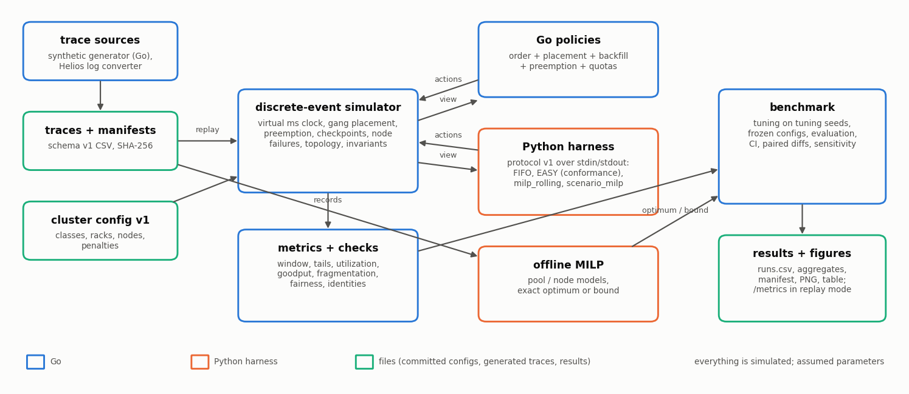

# Architecture

Everything in this repository runs in simulation: a deterministic discrete-event simulator of a GPU cluster, scheduling policies in Go and in a Python harness, and a benchmark that compares them. Nothing talks to Kubernetes or to real GPUs.

## Modules

| Path | Responsibility | Depends on |
|---|---|---|
| `internal/clock` | whole-millisecond virtual time, decimal-second parsing and formatting, the work-to-duration rounding rule | – |
| `internal/rng` | one random stream per component: FNV-1a(name) xor seed, SplitMix64, PCG | – |
| `internal/api` | job record (trace schema v1), the read-only scheduling view, actions and decisions, the topology factor and rate helpers | clock |
| `internal/trace` | trace loader and writer (schema v1, line-numbered errors), manifests with SHA-256, the workload generator, the Helios `cluster_log.csv` converter (Tier 2) | api, clock, rng |
| `internal/cluster` | cluster configuration v1: loader, validation, node order (rack, name), work capacity | api, clock |
| `internal/queue` | the **order** part: `fifo`, `priority` (with aging), `shortest_estimate`, `drf` | api, clock |
| `internal/placement` | the **placement** part: `first_fit`, `best_fit`, `least_fragmentation`, `topology_aware`, `hetero_ect` (Tier 2) | api, metrics (size distribution) |
| `internal/preemption` | the **preemption** part: victims that minimize lost work; the checkpoint retention rule | api, clock, placement |
| `internal/policy` | the `Policy` interface, the composition of the four parts with the **backfill** part (`none`, `easy`, `conservative`, `easy_predicted`, `easy_oracle`, `risk`), the quota suffixes (`+quota`, `+quota_strict`, `+reclaim`), plan replay, the one factory | the parts above |
| `internal/metrics` | per-job records, invariant and identity checks, the metric collector, fragmentation, Student-t intervals | api, clock |
| `simulator/` | the event loop: submissions, completions, preemption, grace periods, node failures and repairs, ticks and wake-ups, action validation, accounting | api, cluster, metrics, policy (interface), preemption |
| `internal/extpolicy` | Go client of the external-policy protocol (child process, JSON lines, timeouts, stderr capture) | api |
| `internal/exporter` | replay mode: paces a run against the wall clock and serves the latest cluster state as Prometheus text-format gauges on `/metrics` (standard library only) | metrics |
| `internal/bench` | scenarios, trace generation and replay of downloaded logs, failure schedules, the parallel runner, tuning, evaluation, MILP experiments, the capacity sweep, aggregation, manifests | everything above |
| `cmd/scheduler` | one run from the command line (cluster + trace or workload + policy → metrics JSON); `-replay-speedup` turns on replay mode with `/metrics` on 127.0.0.1 | |
| `cmd/benchmark` | tuning, full evaluation, quick smoke run, decision-cost microbenchmark, figures | |
| `harness/` | Python: protocol server, view model, FIFO and EASY (for conformance), `milp_rolling`, `scenario_milp` (Tier 2), the offline MILP models, exhaustive search, the solver CLI and the capped solver worker process | numpy, scipy |
| `scripts/` | figures and the result table from committed results; the experiment-config generator | matplotlib |

Policy, metrics, and trace packages import neither the simulator, nor `net/http`, nor `time.Now`. The simulator measures wall-clock decision time only through an injected function, so tests run without it.

## The simulation loop

1. The benchmark generates a trace from a workload configuration and a seed, writes it with its manifest to `benchmarks/outputs/<experiment>/traces/`, and replays it from that file (the manifest's SHA-256 is checked).
2. The simulator keeps the time of the next submission, completion, grace release, node failure or repair, tick, and requested wake-up, and jumps to the earliest.
3. At each instant it applies grace releases and completions (by job ID), then repairs and failures (a failure kills and requeues the jobs on the node), then submissions (in trace order), then invokes the policy once if jobs are pending, with a fresh view.
4. The policy returns an ordered action list. Each action is validated and applied (starts allocate all workers at once; preemptions compute retained and lost work). An invalid action aborts the run with an error that names the policy.
5. After the actions, the simulator samples the cluster state (allocation, free GPUs, stranded GPUs, the blocked indicator) for the time-weighted metrics.
6. The run ends when every feasible job has completed. Nothing running, jobs pending, no future event, and no start on a second call is a deadlock error.
7. The benchmark checks the invariants and the accounting identities of every run, computes the metrics and J, and writes one row.

## One interface for Go and Python policies

A policy is `Schedule(view) -> decision`. Go policies implement it directly. A Python policy is wrapped by `extpolicy.Client`, which implements the same interface: it starts `python -m harness.policy_server` at the first call, sends the cluster description in a `hello` message, then one `schedule` message (the view as JSON) per invocation, and converts the reply into the same decision type. The simulator cannot tell the two apart, which is what makes the conformance check possible: the Go and Python versions of FIFO and EASY produce identical assignment logs on shared traces (`internal/extpolicy`, check 8). The protocol is defined in `docs/contracts.md` §6.

## A benchmark run

`go run ./cmd/benchmark -tune` runs only the tuning seeds: the reference values of J, the default parts (placement, then backfill, then order, on S1 at load 0.8), and an equal-budget random search for every parameterized policy; it writes `configs/tuned/tuned.json`, which is committed before any evaluation. `go run ./cmd/benchmark` then runs every scenario on the evaluation seeds with the frozen configuration, in parallel (half the logical processors by default), the S8 MILP experiments (Python offline solver, plan replay, gaps), the solve-time sweep, the sensitivity variants, the decision-cost microbenchmark, writes `benchmarks/results/<experiment>/` with a manifest, and draws the figures. `-quick` runs a small subset into the ignored `benchmarks/outputs/quick/`.

## Replay mode and real traces (Tier 2)

`cmd/scheduler -replay-speedup N` runs one simulation paced at N simulated seconds per wall second and serves the latest state on `http://127.0.0.1:18200/metrics` (Prometheus text format: pending and running jobs, free and allocated GPUs, utilization, stranded GPUs, the fragmentation indicator). The values are simulated; nothing is scraped from a real cluster.

`scripts/fetch_helios.sh` and `scripts/fetch_helios.ps1` download the Helios traces (CC-BY-4.0) into the ignored `benchmarks/outputs/helios/` and check their SHA-256. Scenario S13 converts a few days of the Venus cluster's `cluster_log.csv` into schema v1 with synthetic estimates and replays it on a simulated cluster derived from the log's own capacity file. Without the download, S13 is skipped and the manifest says so.

## What is not here

No Kubernetes integration (a scheduling-framework adapter is planned, Tier 3), no Prometheus server or scraping (only the replay-mode endpoint above), no gRPC transport, no Philly or Alibaba trace converter. See the README for the full status.
